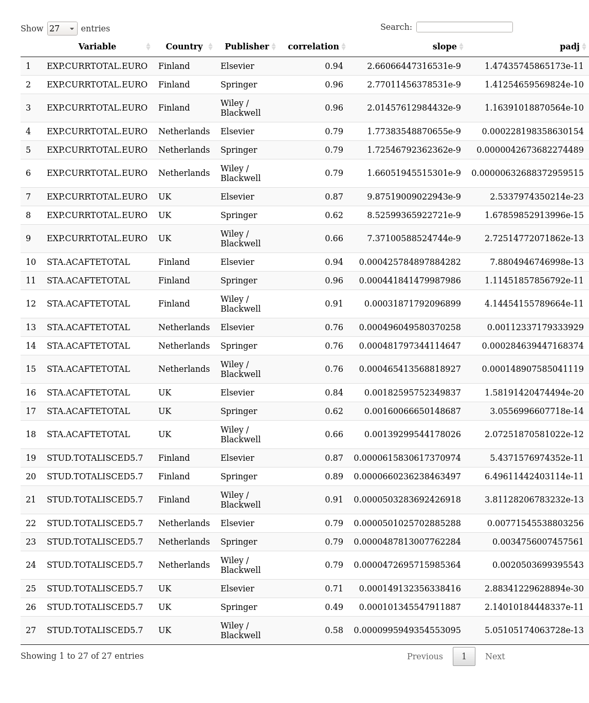

All prices were converted in EUR before the analysis.

The most comprehensive longitudinal per publisher data sets are available from 
Canada (2014-2016), Chile (2008-2015), Finland (2010-2016), France (2009-2015), Netherlands (2011-2015), and UK (2010-2016). Data for Argentina (2008-2016) is also available but we could not verify the source. In most countries, the data is available only for some of the largest publishers and/or institutions.

Figure  1: Annual cost increase for Elsevier, Wiley/Blackwell and Springer. In some data sets, the number of included institutions varies notably by year (for instance in Finland 2016 there is notable increase of listed publishers and organizations in the data set 57 vs. 71 organizations 2015-2016; and 200 vs. 258 publishers). However, the observations remain qualitatively similar also when the analysis is limited only to those publishers that have data available for the complete time span..

Figure  2: University ranking (Times ranking) variables versus subscription costs with selected publishers.

|Variable     |Country     |Publisher         |correlation        | slope| padj|
|:------------|:-----------|:-----------------|:------------------|-----:|----:|
|world_rank   |Finland     |Elsevier          |-0.57738167673964  |  0.00| 0.00|
|world_rank   |Finland     |Springer          |-0.676083594544069 |  0.00| 0.00|
|world_rank   |Finland     |Wiley / Blackwell |-0.732960138880905 |  0.00| 0.00|
|world_rank   |Netherlands |Elsevier          |-0.853563956930838 |  0.00| 0.00|
|world_rank   |Netherlands |Springer          |-0.93724669780641  |  0.00| 0.00|
|world_rank   |Netherlands |Wiley / Blackwell |-0.953983245981524 |  0.00| 0.00|
|world_rank   |UK          |Elsevier          |-0.649698649094827 |  0.00| 0.00|
|world_rank   |UK          |Springer          |-0.694414181556696 |  0.00| 0.00|
|world_rank   |UK          |Wiley / Blackwell |-0.681633965832394 |  0.00| 0.00|
|research     |Finland     |Elsevier          |0.499129052170934  |  0.01| 0.00|
|research     |Finland     |Springer          |0.507059339358995  |  0.02| 0.00|
|research     |Finland     |Wiley / Blackwell |0.541347361511353  |  0.01| 0.00|
|research     |Netherlands |Elsevier          |0.616666666666667  |  0.03| 1.43|
|research     |Netherlands |Springer          |0.7                |  0.03| 1.15|
|research     |Netherlands |Wiley / Blackwell |0.733333333333333  |  0.03| 1.09|
|research     |UK          |Elsevier          |0.713702645074882  |  0.01| 0.00|
|research     |UK          |Springer          |0.745387165396528  |  0.02| 0.00|
|research     |UK          |Wiley / Blackwell |0.719647412299567  |  0.01| 0.00|
|citations    |Finland     |Elsevier          |0.55338649302164   |  0.01| 0.01|
|citations    |Finland     |Springer          |0.640588772284605  |  0.01| 0.00|
|citations    |Finland     |Wiley / Blackwell |0.614779718821454  |  0.01| 0.00|
|citations    |Netherlands |Elsevier          |0.966666666666667  |  0.01| 0.00|
|citations    |Netherlands |Springer          |0.966666666666667  |  0.01| 0.00|
|citations    |Netherlands |Wiley / Blackwell |0.933333333333333  |  0.01| 0.00|
|citations    |UK          |Elsevier          |0.445538903109112  |  0.01| 0.00|
|citations    |UK          |Springer          |0.46928077452499   |  0.02| 0.00|
|citations    |UK          |Wiley / Blackwell |0.557883905867982  |  0.02| 0.00|
|num_students |Finland     |Elsevier          |0.852293775812234  |  0.04| 0.00|
|num_students |Finland     |Springer          |0.909443551060583  |  0.04| 0.00|
|num_students |Finland     |Wiley / Blackwell |0.914540186069889  |  0.04| 0.00|
|num_students |Netherlands |Elsevier          |0.866025403784439  |  0.03| 0.00|
|num_students |Netherlands |Springer          |0.866025403784439  |  0.04| 0.00|
|num_students |Netherlands |Wiley / Blackwell |0.866025403784439  |  0.03| 0.00|
|num_students |UK          |Elsevier          |0.575650490865022  |  0.03| 0.00|
|num_students |UK          |Springer          |0.559381945742138  |  0.04| 0.00|
|num_students |UK          |Wiley / Blackwell |0.613790580087192  |  0.04| 0.00|

Table  1: University ranking (Times ranking) variables versus subscription costs with selected publishers. Spearman correlation, linear model slope and Bonferroni-adjusted p-value.

Figure  3: University scoring (ETER) variables versus subscription costs with selected publishers.

Table  2: ETER variables versus subscription costs with selected publishers. Spearman correlation, linear model slope and Bonferroni-adjusted p-value.

Figure  4: Cost timelines for selected publishers.

Figure  5: Number of countries with data for at least one year. Publishers with more than one country are shown.

