All prices were converted in EUR before the analysis.

The most comprehensive longitudinal per publisher data sets are available from 
Canada (2014-2016), Chile (2008-2015), Finland (2010-2016), France (2009-2015), Netherlands (2011-2015), and UK (2010-2016). Data for Argentina (2008-2016) is also available but we could not verify the source. In most countries, the data is available only for some of the largest publishers and/or institutions.

Figure  1: Annual cost increase for Elsevier, Wiley/Blackwell and Springer. The cost information for these 3 publishers is available for all 5 countries with longitudinal data. In some data sets, the number of included institutions varies notably by year; to reduce bias associated with differences in data completeness across years we included only those institutions have been included that have data for all years within a given country. (for instance in Finland 2016 there is notable increase of listed publishers and organizations in the data set 57 vs. 71 organizations 2015-2016; and 200 vs. 258 publishers).

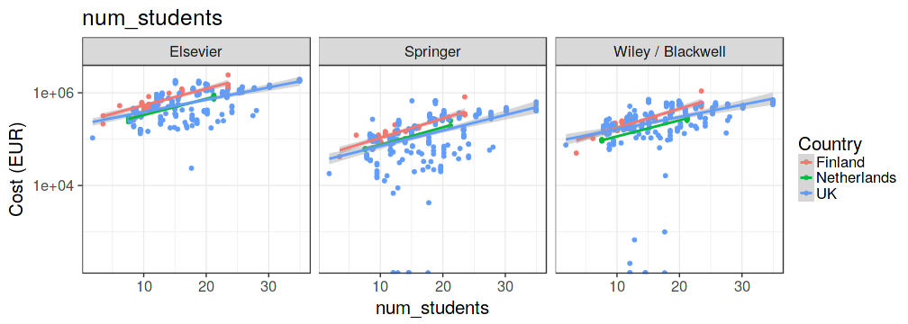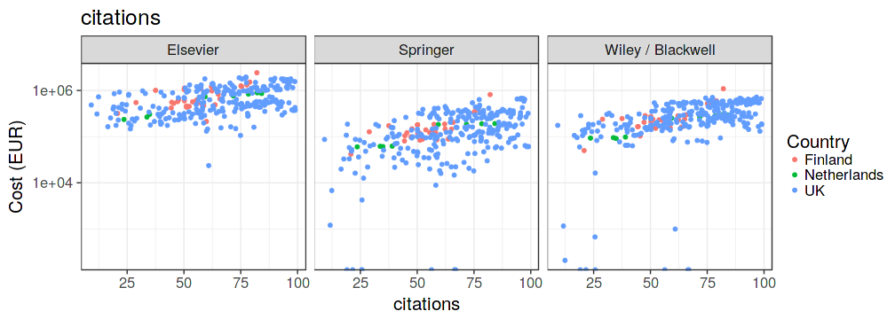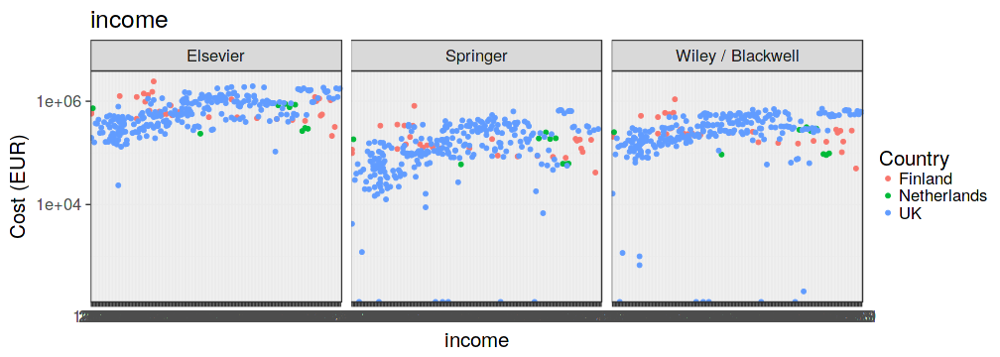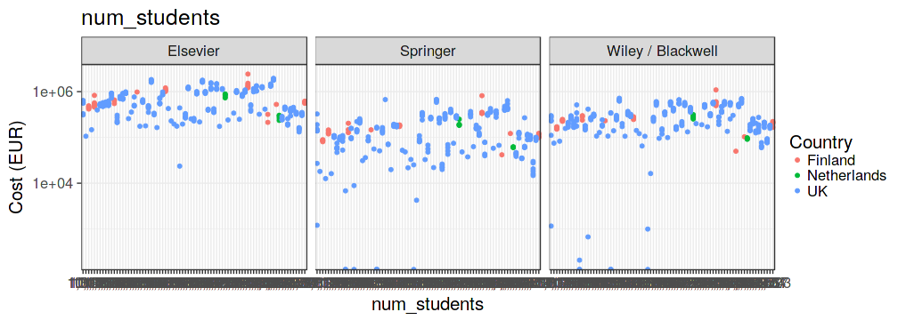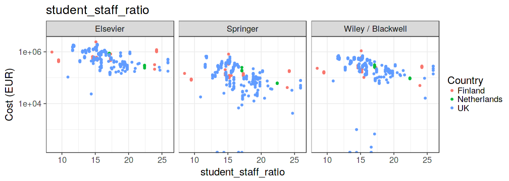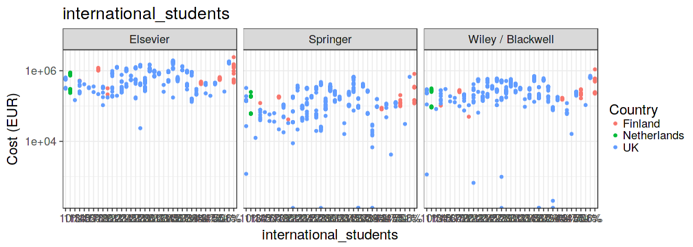

Figure  2: University ranking (Times ranking) variables versus subscription costs with selected publishers.

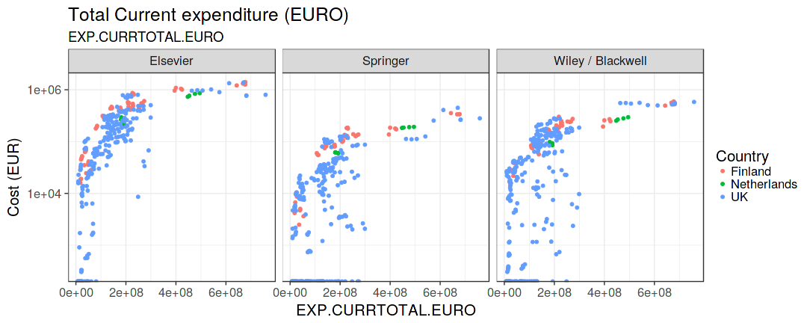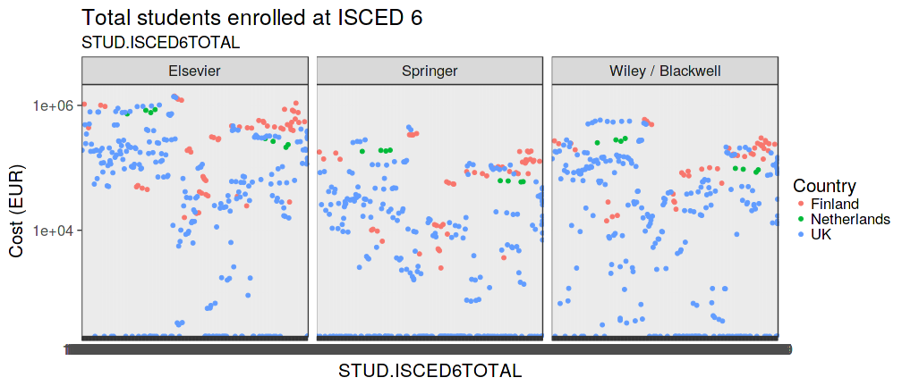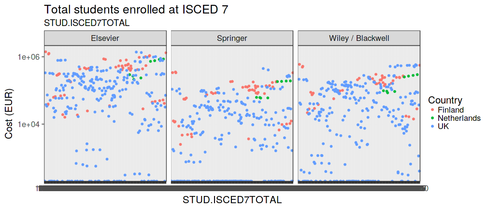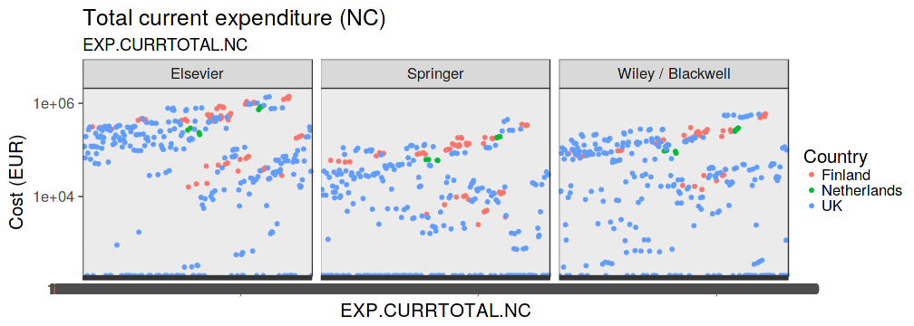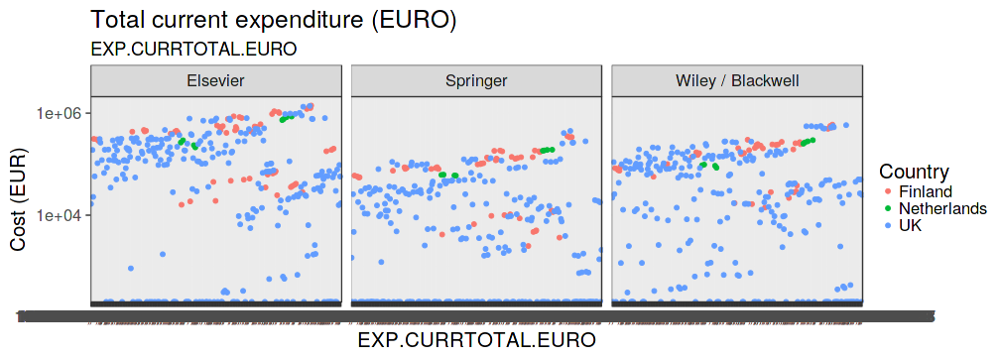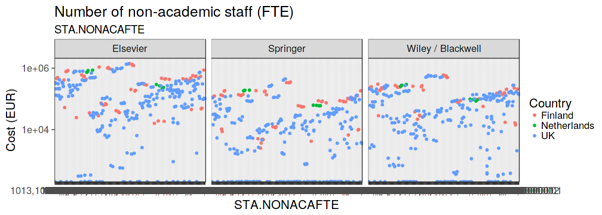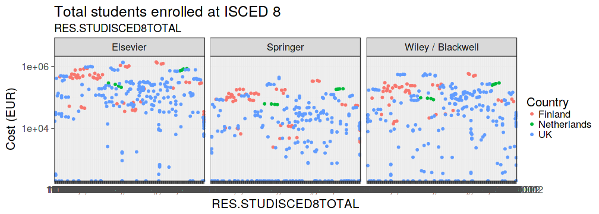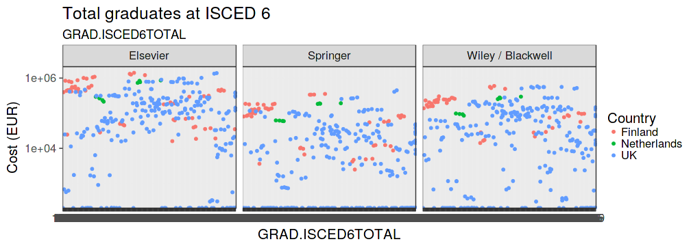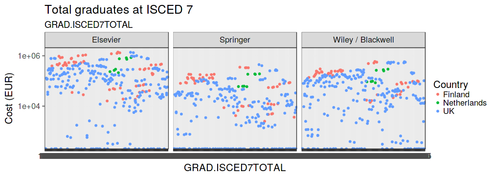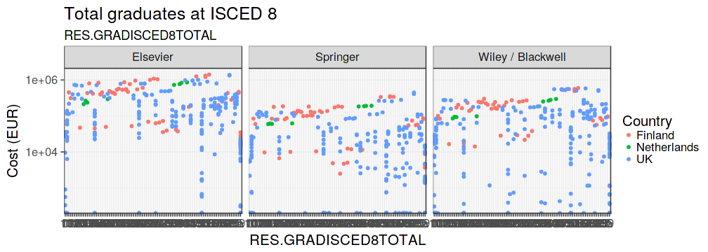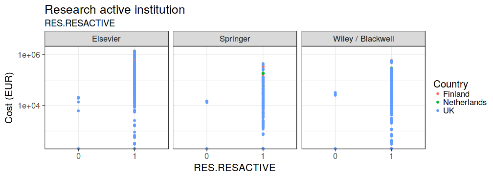

Figure  3: University scoring (ETER) variables versus subscription costs with selected publishers.

Figure  4: Cost timelines for selected publishers.

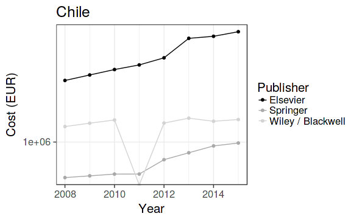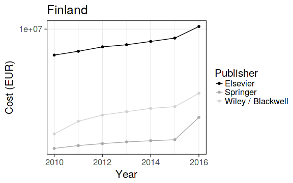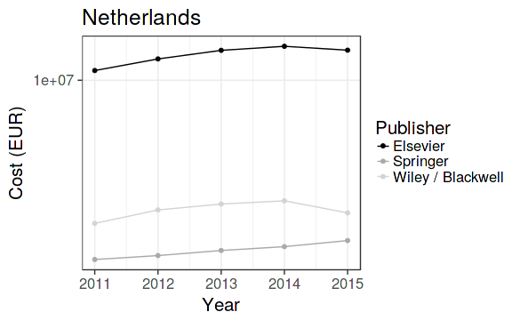

Figure  5: Cost timelines for three selected publishers.

Figure  6: Number of countries with data for at least one year. Publishers with more than one country are shown.

