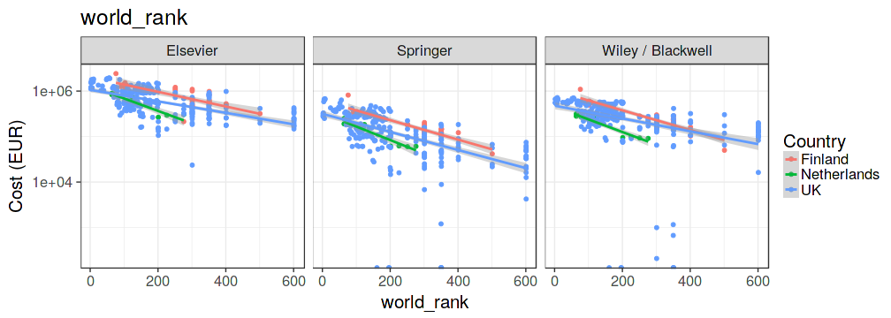
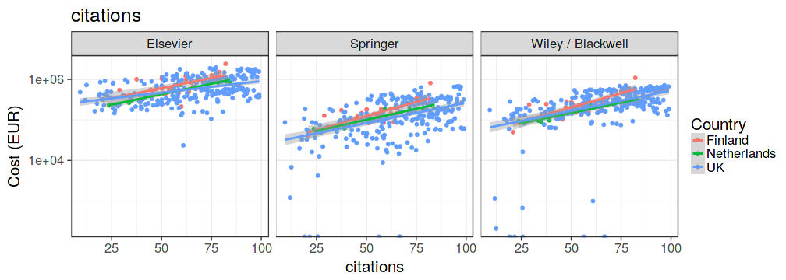

All prices were converted in EUR before the analysis.

The most comprehensive longitudinal per publisher data sets are available from 
Canada (2014-2016), Chile (2008-2015), Finland (2010-2016), France (2009-2015), Netherlands (2011-2015), and UK (2010-2016). Data for Argentina (2008-2016) is also available but we could not verify the source. In most countries, the data is available only for some of the largest publishers and/or institutions.

Figure  1: Same as above but all publishers included. Perhaps we like to include this figure instead and just discuss the issues that affect the comparison ie. latter years have more complete lists of publishers etc..

Figure  2: University ranking (Times ranking) variables versus subscription costs with selected publishers.

Figure  3: University scoring (ETER) variables versus subscription costs with selected publishers.

Figure  4: Cost timelines for selected publishers.

Figure  5: Number of countries with data for at least one year. Publishers with more than one country are shown.

